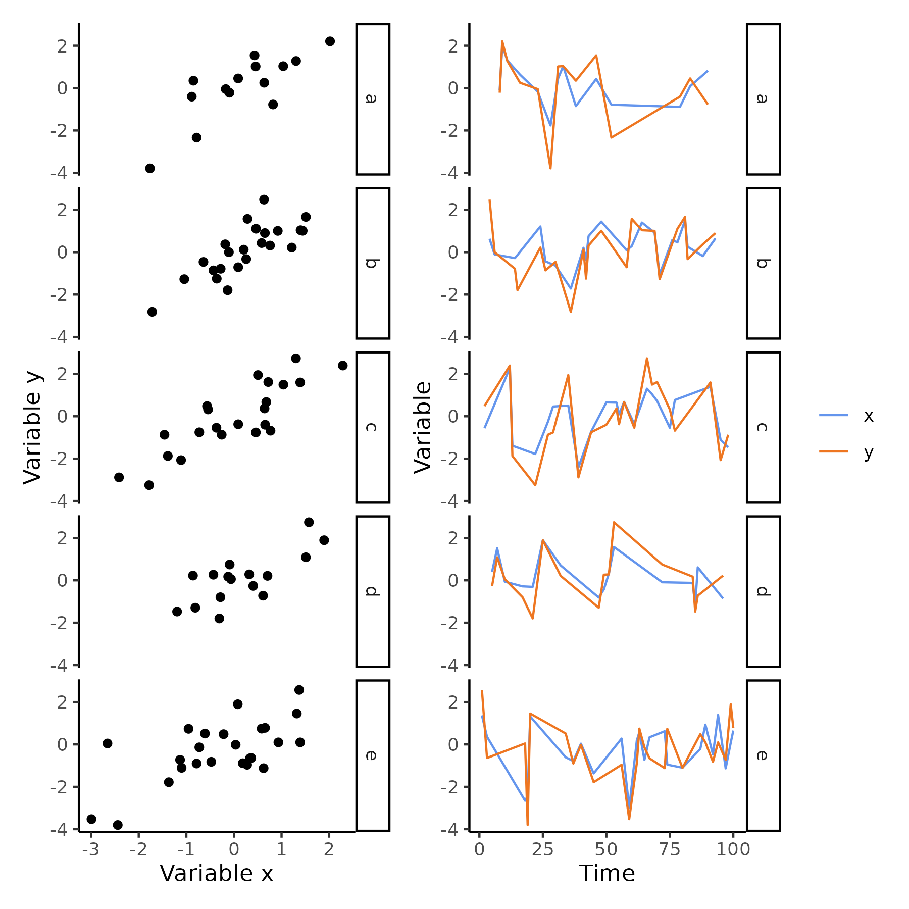
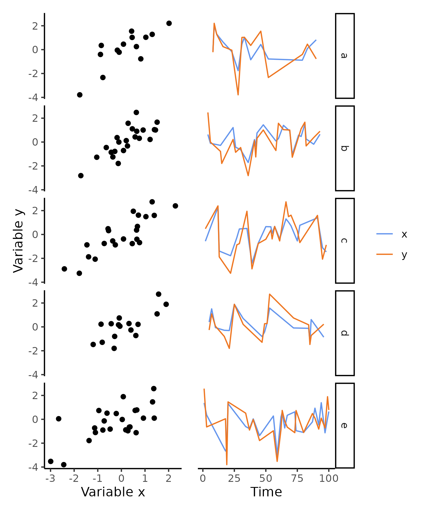

# ggrm

An R package with wrappers around `ggplot2` functions to allow removing chunks of `ggplot` objects with one-liners. For example, the function `rm_axis()` removes the ticks, the text, the title and the bar that compose an axis --- no need to write `element_blank()` many times within the `theme()` function.

## Install

``` r
# install.packages("devtools") # if not installed already
devtools::install_github("rscherrer/ggrm")
```

## Prerequisites

-   R (\>= 4.2.1)

(`ggplot2` is automatically installed as a dependency of `ggrm`.)

## Functions

-   `rm_axis()` to remove either axis completely
-   `rm_strips()` to remove strips and labels from facets (when using `facet_wrap()` or `facet_grid()`)

## Example usage

``` r
library(ggplot2)
library(ggrm)

data <- data.frame(x = 1:3, z = 3:1)

ggplot(data, aes(x = x, y = x)) +
  geom_line() +
  rm_axis("x") # will remove the x-axis completely
```

## Output

One of the main use cases I had was to turn this sort of plot:



into this sort of plot:



Thus saving some space by removing redundant axes and facet strips!
